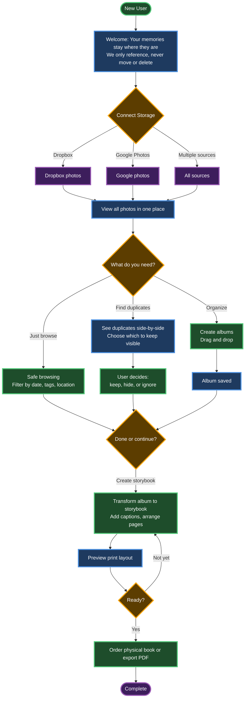

# User Flow - Monica's Storybook

## Product Thesis

Modern technology treats memories as replaceable data, but the most important photos and videos in people's lives are irreplaceable. Users defensively spread memories across multiple cloud services (Dropbox, Google, Amazon, devices), which creates fragmentation, anxiety, and fragility. Existing tools optimize for storage and scale, not emotional safety or human decision-making.

Monica's Storybook does NOT replace storage providers and does NOT delete files.
It is a gentle, non-destructive layer that references existing storage, reduces fragility, and helps users safely turn memories into something tangible (albums / storybooks).

## Flow Explanation

### Entry & Trust Building
- User connects their storage (Dropbox, Google Photos, etc.)
- App shows all photos in one unified view
- Trust established upfront: we reference, never move or delete

### Clarity & Decision Layer
- **Browse:** Filter photos by date, tags, and location
- **Find duplicates:** See them side-by-side, choose which to keep visible
- **Organize:** Create albums with drag-and-drop

### Meaning Creation
- Transform albums into printable storybook layouts
- Preview and adjust pages until satisfied
- Order physical book or export PDF
## System Flow Diagram

**Legend:**
- 🟢 **Green** - User actions (what the user does)
- 🔵 **Blue** - System operations (what you need to build)
- 🟠 **Orange** - Decision points (user chooses)
- 🟣 **Purple** - Completion (goal achieved)

